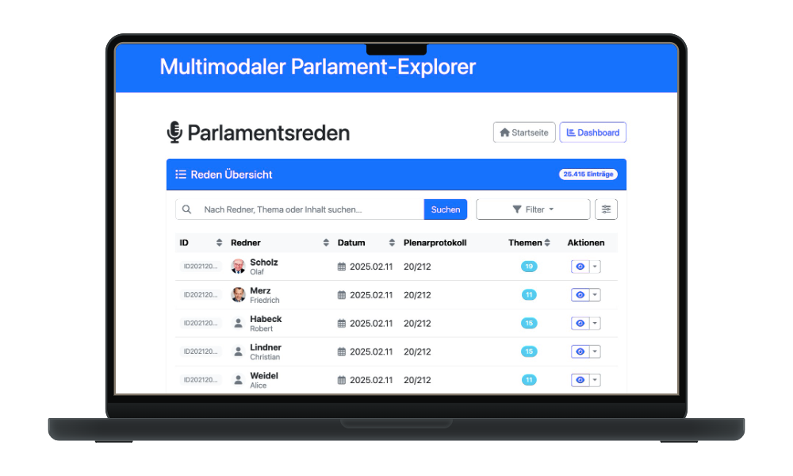
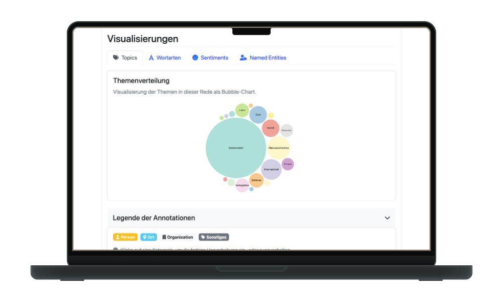

  
  
  
  
  
  

 

  
  <h3 align="center">Multimodal Parliament Explorer</h3>
  
Abschlussprojekt des Programmierpraktikums.

  
  

## Dependencies

* Git
* Docker

## Anleitung zur Benutzung (mit Docker)

1. Repository klonen: `git clone https://github.com/kuuhhl/multimodal_parliament_explorer`
2. Hinein-Navigieren: `cd multimodal_parliament_explorer`
3. Docker-Image erstellen: `docker build -t multimodal_parliament_explorer .`
4. Docker-Container starten: `docker run --rm -d -p 7001:7001 multimodal_parliament_explorer`
5. Im Browser öffnen: [http://localhost:7001](http://localhost:7001)

> Für eine ausführlichere Anleitung geht es [hier](benutzerhandbuch.md) zum Benutzerhandbuch.

## Screenshots

  
  

## Features

* Anzeigen von Parlamentsreden mitsamt Video
* Informationen zu Rednern und Protokollen
* Visualisierung von NLP-Analysen mithilfe von Diagrammen
* Export als XML / PDF
